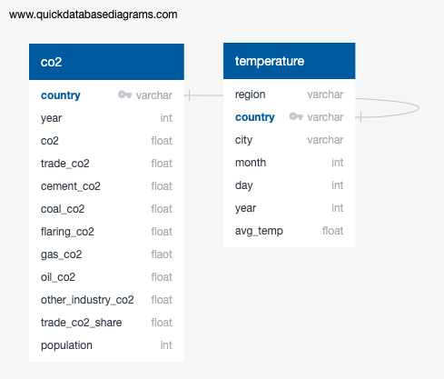
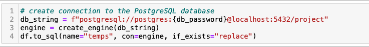
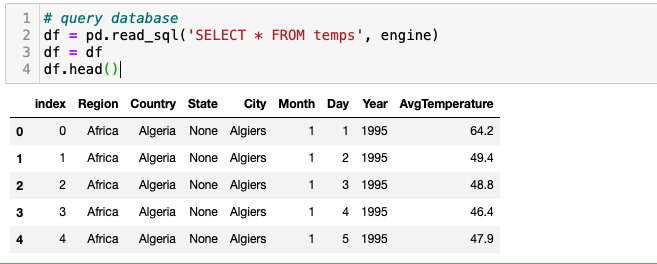

# Fossil Fuels and It's Impact on Temperatures

## A. Presentation 

**[Presentation can be found here](https://docs.google.com/presentation/d/1LIIxNE26tEv9yMHcSfNOcbrMop_bMVocx2V1dUVHUj8/edit#slide=id.p)**

### **1. Topic** 

When fossil fuels are burned, they emit lots of gasses into our atmosphere; specifically carbon dioxide and greenhouse gasses. This causes a rise in temperatures as greenhouse gasses cause rise in temperatures globally as they trap heat in the air. This analysis will be linear as we will discover the trends/patterns between the amount of fossil fuels and their impact with temperature on a global scale from the years of 1995-2020. 

### **2. Reason topic was selected** 

There are many reasons towards climate change, but the one that has contributed the most are greenhouse gasses. 

- greenhouse gasses trap heat in the Earth’s atmosphere causing a rise in temp 
- CO2 is the gas that is emitted the most in the atmosphere accounting for a total of 79%, just in the United States
- Fossil fuels are also non-renewable and unsustainable 

### **3. Source of data** 

We relied on two different datasets for our analysis. 

- Fossil Fuel Emissions Data: [owid-co2-data.csv](https://github.com/sherryli1116/finalproject-group15/files/9924958/owid-co2-data.csv)

  Source: Kaggle.com, accessed 2 November 2022, <https://www.kaggle.com/datasets/kvnxls/co2-emissions-dataset-1750-2020>. Data came from 
  Our World in Data (OWID).  

- Environment Temperature Change Data: [Daily Temperature of Major Cities](https://www.kaggle.com/datasets/sudalairajkumar/daily-temperature-of-major-cities?select=city_temperature.csv) 

  Source: Kaggle.com, accessed 2 November 2022, <https://www.kaggle.com/datasets/sudalairajkumar/daily-temperature-of-major-cities?select=city_temperature.csv>. Data came from National Centers for Environmental Information (NCEI). 

Both datasets include the information and years we need to compelete our analysis. Excess data we will need to be cleaned and/or transformed before we can actually start with our analysis. Our game plan is to create data frames after cleaning the data we want from both datasets and then combining the clean data sets for our final analysis. 

### **4. Questions we hope to answer with our analysis** 

- As fossil fuel emissions increase, does global temperature increase thereafter? 

- Are different areas of the planet affected differently by emission increase?

### **5. Technology** 

For our analysis, we will be using the following- 

- *Python:* Allow us to clean/transform our very large dataset. Use Python functions to get the average of CO2 emissions and temperature.  
- *Jupyter:* Jupyter notebook will be used to run Python and run the specific modules we'll need to create data frames 
- *Pandas:* Create data frames after we have cleaned/transformed our data. For our final analysis, we need to merge both of the clean data frames to get the final data frame to create our visuals.   
- *Matplotlib:* This module will let us create visuals we need for our analysis. This will allow us to determinate what the pattern/trend is between CO2 emissions and temperature.
- *Tableau:* Used to create visualizations and dashboard

### **6. Analysis** 

Need to clean/transform both datasets we are working with as they are very large and contain data we don't need for our analysis. We must filter the dates to 1995-2019, remove unnecessary cities/countries that are not included in both files and remove unnecessary columns/rows. When we have cleaned and transformed both datasets, then we need to merge the datasets to be used in our final analysis. 

Once we have merged our final dataset, next up is creating visualizations that we need to observe the trends in the data. By doing so, we can answer the questions we need for our analysis and if some visualizations are not enough, we might need to dive into creating other data frames to aid in our analysis. It's crucial we understand the patterns between CO2 emissions and temperature in many different regions around the globe to identify the complexity of how fossil fuel emissions can impact temperature in different regions. 

### **7. Recommendation for future analysis & debrief** 

Recommendations for future analysis include exploring other factors that may contribute to temperature changes, such factors include population and GDP. 
Our linear model between CO2 emissions and average tempertures estimates future average temperature based on user input of city and year. Future
enhancements to the project would include building out a site that would allow users to input such parameters and retrieve the predicted average
temperature. 

## B. Machine Learning

### **1. Data Preprocessing**

The following were performed during preprocessing of ‘City_Temperature’ file:

- Dataset contained 2,906,327 rows and 8 columns.
- Used copy() function to copy dataframe while dropping column ‘State’. Analysis will focus on city and country, therefore,
  ‘State’ column deemed unnecessary. 
- Checked for null values. None were noted.  
-	Checked for data types. No changes needed as data types appeared appropriate.
-	Removed values from average temperature column that equaled (-99). These values reflect days in which there was no reading. Rows removed totaled 79,672. 
-	Removed year 2020 due to incomplete data. Rows removed totaled 38,742. 
- Removed cities that had more than 5 years of missing data. Cities removed totaled 34 out of a total of 321. 
-	Ran statistics to identify potential outliers. Performed visual review of data below lower bound and deemed data
  appropriate. There was no data above upper bound. 
-	Used groupby() function to aggregate data by Country, City, and Year. 

Resulting dataframe consists of 85,583 rows and 5 columns. 

The following were performed during preprocessing of ‘owid-co2-data’ file:

-	Dataset contained 25,990 rows and 60 columns.
-	Used copy() function to copy dataframe , retaining columns ‘country’, ‘year’, ‘population’, ‘co2’.
-	Replaced country names for 3 countries to align with ‘City_’Temperature’ dataset. These countries included United States,
  Serbia, and Netherlands. 
-	Removed values for years before 1995 and year 2020 to align with years covered in ‘City_Temperature’ dataset. 
-	Renamed columns ‘Country’ and ‘Year’.
-	Merged dataframe with ‘City_Temperature’ dataset on ‘Country’ and ‘Year’.
-	Checked for null values. None were noted. 
-	Ran statistics to identify potential outliers. No outliers were noted. 

Resulting dataframe consists of 7,010 rows and 6 columns. 

We note that there were limitations with data obtained. Carbon emissions amounts were shown at the country level, while
average temperatures were shown by city. In merging the datasets, an assumption was made to use the carbon emissions by
country at the city level. As such, carbon emissions noted for each city are reflective of the corresponding country's
total emissions. 

### **2. Model selection**

Based on an approximate linear relationship between cumulative carbon emissions and global average temperature change,
a linear regression model was selected as the most appropriate model to estimate future temperatures on a city basis. Linear regression
models are easy to implement and interpret but may be prone to overfitting. Datasets were reviewed to identify
potential outliers. 

### **3. Results**

Using the linear regression model, the dependent variable was set to average temperature and the independent variable 
to carbon emissions. The model was ran for each city in the dataset. Our hypothesis - regional impacts would be visible based on CO2 or areas of the world. Based on model output, cities in similar regions are affected differently. CO2 emissions effects are a worldwide impact regardless of CO2 generation. We note that CO2 emissions and temperature have a positive linear relationship with one another, but neither location nor CO2 emissions are a driving factor to determine what cities have the largest temperature changes. 

A linear regression model was built for all of the following data pairings on a per city basis.  Temperature over time, CO2 over time, and Temperature by CO2 change.  It was identified that the strongest corrrelation was with Temperature and Time.  This is logical as CO2 emissions on a per city basis are not a strong indicator for the worldwide impact of climate chnage. 

To make best use of this data, a calculator was constructed to allow users to query the database and run a temperature simulation on any city in the data set to produce a predicted temperature based on current temperature trends.  

Linear regression model can be found [here](https://github.com/sherryli1116/finalproject-group15/blob/main/final_df.ipynb).

Model Diagram

## C. Database

We opted to proceed without the creation of a database for this project, as our analysis only used two different datasets. A sample ERD 
was prepared to show the tables that can be created if needed and uploaded into a database. Note that ERD is a only an excerpt of all the columns in 
the original dataset. 

Further, we have included screenshots of code to be used to connect to the database from Jupyter Notebook as well as query the 
database. 

## D. Dashboard

### Tools and Interactive Element
We will be using Tableau to show data visualization. It will display the relationship between CO2 emission and teperature according to different
countries. Viewers will be able to see the changes by selecting different countries using the filter option on Tableau. 

As part of our visualizations, we have included:

- CO2 Emissions by Year - In 2019, there were approximately 36 billion metric tons of CO2 emitted globally. 
- CO2 Emmissions - Top 20 Countries - Shows total CO2 emissions between 1995 - 2019 by the top 20 countries. 
- Yearly CO2 Emissions and Average Yearly Temperatures - Interactive map that allows users to select different years and view changes in yearly CO2
  emissions and average yearly temperatures.
- CO2 Emissions and Average Temperature - Shows the linear relationship between CO2 emissions and average temperature.

Tableau dashboard can found [here](https://public.tableau.com/app/profile/xuechen.li4348/viz/tableau1_16691916900270/CO2EmissionsByYear?publish=yes).

