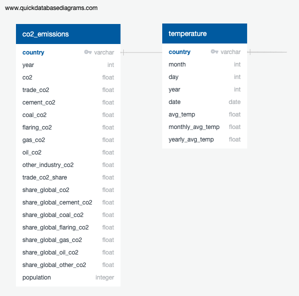

# finalproject-group15

## Presentation 

**[Presentation Slides Link](https://docs.google.com/presentation/d/1LIIxNE26tEv9yMHcSfNOcbrMop_bMVocx2V1dUVHUj8/edit#slide=id.p)**

### **Topic:** 

When fossil fuels are burned, they emit lots of gasses into our atmosphere; specifically carbon dioxide and greenhouse gasses. This causes a rise in temperatures as greenhouse gasses cause rise in temperatures globally as they trap heat in the air. This analysis will be linear as we will discover the trends/patterns between the amount of fossil fuels and their impact with temperature on a global scale from the years of 1995-2020. 

### **Reason why topic was selected:** 

There are many reasons towards climate change, but the one that has contributed the most are greenhouse gasses. 

- greenhouse gasses trap heat in the Earth’s atmosphere causing a rise in temp 
- CO2 is the gas that is emitted the most in the atmosphere accounting for a total of 79%, just in the United States
- Fossil fuels are also non-renewable and unsustainable 

### **Source of data:** We will be using two CSV files that contain our very large datasets. 

- Fossil Fuel Emissions Data: [owid-co2-data.csv](https://github.com/sherryli1116/finalproject-group15/files/9924958/owid-co2-data.csv)

  Source: Kaggle.com, accessed 2 November 2022, <https://www.kaggle.com/datasets/kvnxls/co2-emissions-dataset-1750-2020>

- Environment Temperature Change Data: [Daily Temperature of Major Cities](https://www.kaggle.com/datasets/sudalairajkumar/daily-temperature-of-major-cities?select=city_temperature.csv) 

  Source: Kaggle.com, accessed 2 November 2022, <https://www.kaggle.com/datasets/sudalairajkumar/daily-temperature-of-major-cities?select=city_temperature.csv>

Both datasets include the information and years we need to compelete our analysis. There is excess data we will need to clean/transform before we can actually start with our project. Our game plan is to create data frames after cleaning the data we want from both datasets and then combining the clean data sets for our final analysis. 

### Questions we hope to answer with our analysis 

- As fossil fuel emissions increase, does global temperature increase thereafter? 

- Are different areas of the planet affected differently by emission increase?

- What years did the temperature first begin to have a significant change?

### **Technology:** 

For our analysis, we will be using the following- 

- *Python:* Allow us to clean/transform our very large dataset. Use Python functions to get the average of CO2 emissions and temperature.  
- *Jupyter :* Jupyter notebook will be used to run Python and run the specific modules we'll need to create data frames 
- *Pandas:* Create data frames after we have cleaned/transformed our data. For our final analysis, we need to merge both of the clean data frames to get the final data frame to create our visuals.   
- *Matplotlib:* This module will let us create visuals we need for our analysis. This will allow us to determinate what the pattern/trend is between CO2 emissions and temperature.  

### **Data Exploration:** 

Need to clean/transform both datasets we are working with as they are very large and contain data we don't need for our analysis. We must filter the dates to 1950-2020, remove unnecessary cities/countries that are not included in both files and remove unnecessary columns/rows. When we have cleaned and transformed both datasets, then we need to merge the datasets to be used in our final analysis. 

- **CO2 Emissions:** 

  - Rows: 25,990 rows
  - Columns: 60 columns 
  - Raw data of CO2 emissions by every country from 1750-2020
  - Includes every factor that affects the emission along with emission rates of methane and nitrous oxide. 
- **Temperature Change:**

  - Rows: 2,906,329 rows
  - Columns: 8 columns 
  - Daily level average temperature values 
  - As this is a very large dataset, it was broken down in separate txt files for each city. 

### **Analysis:** 

Once we have merged our final dataset, next up is creating visualizations that we need to observe the trends in the data. By doing so, we can answer the questions we need for our analysis and if some visualizations are not enough, we might need to dive into creating other data frames to aid in our analysis. It's crucial we understand the patterns between CO2 emissions and temperature in many different regions around the globe to identify the complexity of how fossil fuel emissions can impact temperature in different regions. 

Graphs showins the total CO2 by year can be found [here](https://github.com/sherryli1116/finalproject-group15/blob/main/city_temperature_graphs.ipynb). 

## Database

We will not be using a database for our analysis because we don't have too much datasets we're working with. Moreover, we're creating visualizations using Matplotlib and may use tools to showcase our visualizations. Therefore, there was no need to create a database for our project. 

An ERD was prepared to show the two tables that can be used if needed.   

## Machine Learning and Data Analysis Plan

Using these Datasets, a linear model will be developed on a per city basis.  The assumption is that Linear is most appropriate as the impacts of carbon
emissions on the relative temperature.  Using the developed models, a estimation will be built using linear regression to form an esimate of future 
temperatures of available cities by years.  SciKit modeling through Supervised Machine Learning will be used as the most efficient system for large
datasets but with few variables. 

## Proposed Project

## **Dashboard**

**[Storyboard Link](https://docs.google.com/presentation/d/1l64_2mwr48J9JcGY_hhqfUuMYhpYAVZeGpV3cXkw2LA/edit?usp=sharing)**

### Tools and Interactive Element
We will be using Tableau to show data visualization. It will display the relationship between CO2 emission and teperature according to different countries. Viewers will be able to see the changes by selecting different countries using the filter option on Tableau. 
